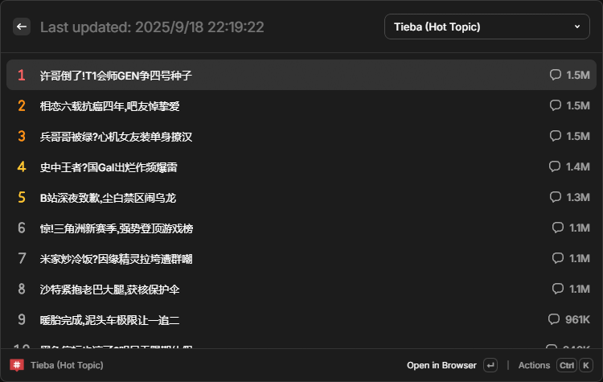

<p align="center">
  
</p>

<h1 align="center">
Trending Topics <sup><em>for Raycast</em></sup>
</h1>

<p align="center">
一个用于快速查看和打开多个平台的热搜榜的 Raycast 扩展。
</p>


<p align="center">
  <a href="./README.en.md">English</a>
  / 简体中文
</p>

## 支持的平台

- [哔哩哔哩](https://www.bilibili.com/)
- [贴吧](https://tieba.baidu.com/)
- [抖音](https://www.douyin.com/)

- 以及更多即将支持的平台...

## 安装

此扩展尚未发布到 Raycast 商店，因此你需要通过克隆仓库并在开发模式下运行来手动安装。

在安装之前，你应该确保已经安装了 [Node.js](https://nodejs.org/en/download/) 和 [pnpm](https://pnpm.io/installation)。

0. 如果你尚未安装 PNPM，请先安装：
```bash
npm install -g pnpm
```

1. 克隆仓库：
```bash
git clone https://github.com/Lu-Jiejie/raycast-trending-topics
```

2. 进入扩展目录并安装依赖项：
```bash
cd raycast-trending-topics
pnpm install
```

3. 安装：
```bash
pnpm run dev
```
